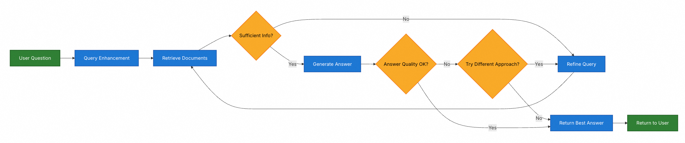

# RAG文件上传功能说明

## 功能概述

本项目新增了RAG（检索增强生成）文件上传功能，允许用户上传文档并在聊天过程中利用这些文档内容进行智能问答。

## 功能特点

1. **多格式文档支持**：支持上传 `.txt`、`.pdf`、`.doc`、`.docx` 格式的文档
2. **可视化文件管理**：提供独立的RAG文件管理页面，方便查看和管理已上传的文档
3. **智能检索**：系统会自动将上传的文档内容向量化存储，支持语义检索
4. **无缝集成**：上传的文档内容会在用户提问时自动作为上下文增强AI回答的准确性

## 使用方法

### 1. 上传文档
- 点击顶部选项卡中的“RAG文件管理”进入文件管理页面
- 点击“上传文件”按钮
- 选择支持格式的文档文件进行上传
- 上传完成后文件会出现在文件列表中

### 2. 查看和管理文档
- 文件列表显示已上传的文档名称、大小和上传时间
- 点击“刷新列表”可重新加载文件列表
- 选中文件后点击“删除选中文件”可删除文档

### 3. 在聊天中使用RAG功能
- 上传文档后，可以在聊天中提出相关问题
- 系统会自动检索相关文档内容并结合这些信息生成答案
- 无需特别操作，系统会在后台自动使用相关文档内容

## 技术架构

### 后端组件
- **RagController.java**：处理文件上传、管理和检索请求
- **RagConfig.java**：配置向量存储等RAG相关组件
- **向量数据库**：使用内存向量存储，支持文档内容的语义检索

### 前端组件
- **ChatAssistantView.java**：新增选项卡界面，集成RAG管理功能
- **RAG管理面板**：提供文件上传、列表展示和管理功能
- **RAG集成**：在聊天功能中自动检索相关文档内容

## API接口

### 文件上传
- **POST** `/rag/upload`
- 参数：multipart/form-data 格式的文件
- 返回：上传结果和文件信息

### 文件列表
- **GET** `/rag/files`
- 返回：已上传文件列表

### 文件删除
- **DELETE** `/rag/files/{fileId}`
- 返回：删除结果

### 文档检索
- **POST** `/rag/search`
- 参数：查询文本
- 返回：相关的文档内容

## 注意事项

1. 上传的文档会被解析并存储在内存中，重启应用后数据会丢失
2. 单个文件大小限制为5MB
3. 文档内容会经过切分处理，以提高检索效率
4. RAG功能会增强AI回答的准确性，但不会替代基础的AI能力

## 混合 RAG
混合 RAG 结合了两步 RAG 和 Agentic RAG 的特点。它引入了中间步骤，如查询预处理、检索验证和生成后检查 。
这些系统比固定管道提供更多灵活性，同时保持对执行的一定控制。

典型组件包括：
查询增强：修改输入问题以提高检索质量。这可能涉及重写不清晰的查询、生成多个变体或用额外上下文扩展查询。
检索验证：评估检索到的文档是否相关且充分。如果不够，系统可能会优化查询并再次检索。
答案验证：检查生成的答案的准确性、完整性以及与源内容的一致性。如果需要，系统可以重新生成或修订答案。
架构通常支持这些步骤之间的多次迭代：

**Retrieve Documents（检索文档）**
在 RAG（检索增强生成）架构中，**Retrieve Documents（检索文档）** 指的是系统根据用户的提问，从向量数据库（如 Milvus）
中查找并返回最相关的信息片段的过程。具体包含以下三个核心步骤：
1.  **向量化查询**：
    将用户输入的自然语言问题，转换成**向量**，使其能与数据库中的数据格式进行数学计算。
2.  **相似度搜索**：
    在向量数据库（Milvus）中，计算问题向量与库中存储的“文档切片”向量之间的相似度。通常使用算法（如 HNSW）快速找出距离最近
（即最相关）的 Top K 个片段（例如选出最相关的 5 段文字）。
3.  **返回上下文**：
    将检索到的这 Top K 个文本片段作为**参考文档**，组合成一段 Prompt（提示词），连同用户的原始问题一起发送给大模型（LLM）。
**简单来说：**
它是从海量知识库中，“翻书”找到对应答案所在的“段落”的过程。如果没有这一步，大模型就只能依靠自己训练时的旧记忆来回答，可能会产生幻
觉或无法回答私有领域的问题。